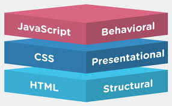

# PORTFOLIO

## name: Tehseen Chowdhary

## email: tehseen@tehseen.com

## phone: 123-456-7890

## address: Jammu, Jammu&Kashmir

## website: [website] "https://tehseen.com"

## social media: [linkedin] "https://linkedin.com/in/tehseen"

### ABOUT

I am a highly motivated and detail-oriented individual with a passion for creating innovative solutions. With a strong mindset to learn and grow, I am always looking for opportunities to improve my skills and knowledge.

### EDUCATION

| Degree           | Field of Study   | University                         | Location | Graduation Date |
| ---------------- | ---------------- | ---------------------------------- | -------- | --------------- |
| Bachelor's       | Computer Science | MNIT Jaipur                        | Jaipur   | 2023-ongoing    |
| Senior secondary | Science          | St. Antony's Convent School School | Jammu    | 2023            |
| Secondary        | Science          | St. Antony's Convent School School | Jammu    | 2021            |

### SKILLS

- [x] **Programming**: _Python_, _Java_, _C++_, _JavaScript_, _HTML_/_CSS_

- [x] **Data Science**: Pandas, NumPy, Matplotlib, Scikit-learn, TensorFlow

- [x] **Operating Systems**: Windows, Linux, macO
 > [!NOTE]
> macos is going on

### PROJECTS

#### 1. Project: Chatbot Development

- **Project Description**: Developed a chatbot using Python and NLTK library to assist users with basic knowledge of python.
  > project image
  > 

#### 2. Project: Web Development

- **Project Description**: Built a simple web application using HTML, CSS, and JavaScript to display information of active users.
  > project image
  > 

### REFERENCE :

- prof xyz ([^contact])

[^contact]: contact no: 9867386423
